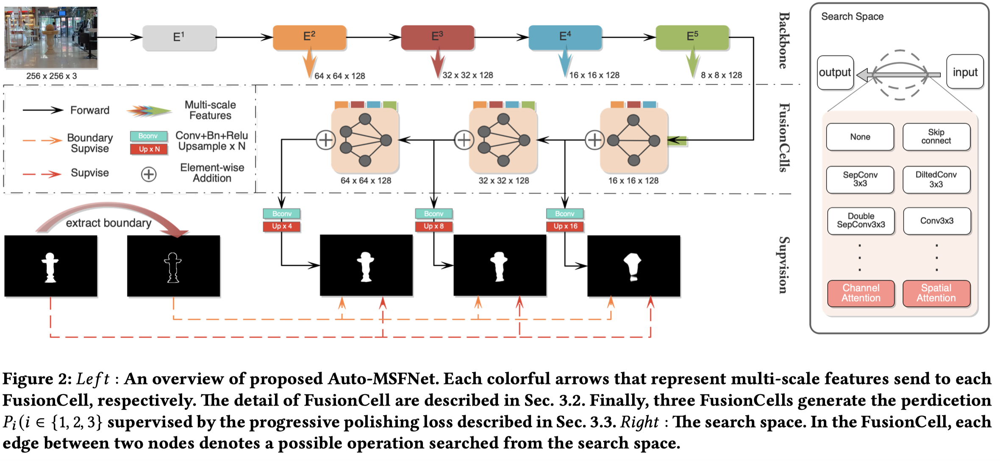
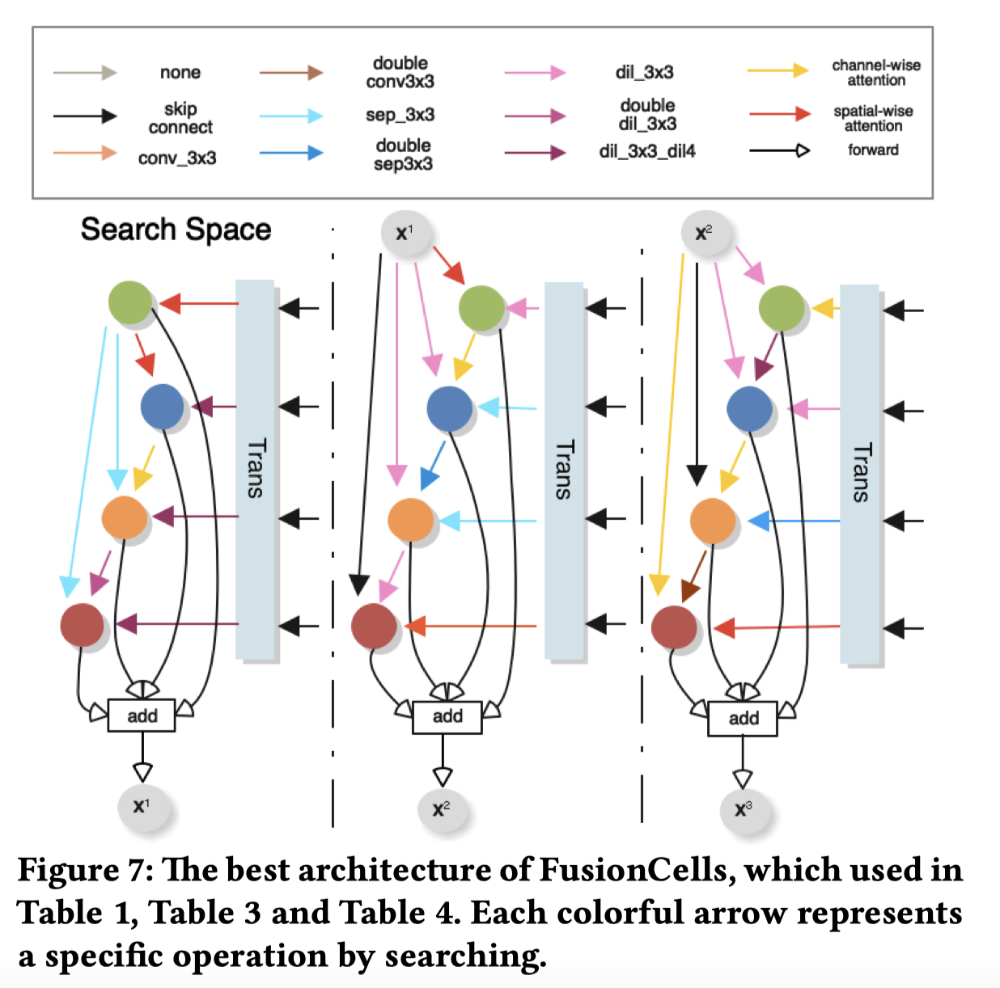
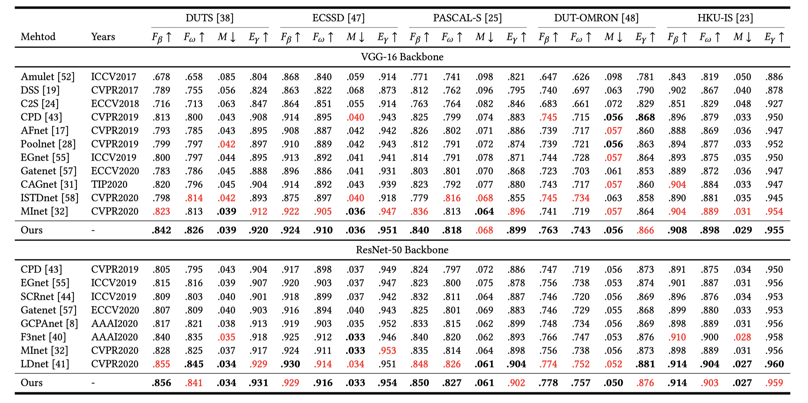
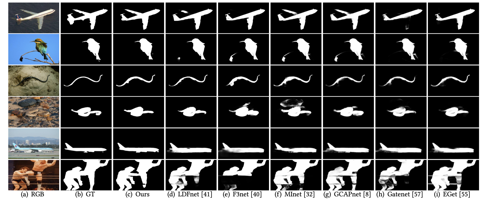

# Auto-MSFNet

This is a a PyTorch implementation of the 2021 ACMMM paper "Auto-MSFNet: Search Multi-scale Fusion Network for Salient Object Detection", this paper can be download by [this link(提取码:a28y)](https://pan.baidu.com/s/14mLCSHXtnuXkjCmuu_9g8A).

## Introduction



Multi-scale features fusion plays a critical role in salient object detection. Most of existing methods have achieved remarkable performance by exploiting various multi-scale features fusion strategies. However, an elegant fusion framework requires expert knowledge and experience, heavily relying on laborious trial and error. In this paper, we propose a multi-scale features fusion framework based on Neural Architecture Search (NAS), named Auto-MSFNet. First, we design a novel search cell, named FusionCell to automatically decide multi-scale features aggregation. Rather than searching one repeatable cell stacked, we allow different FusionCells to flexibly integrate multi-level features. Simultaneously, considering features generated from CNNs are naturally spatial and channel-wise, we propose a new search space for efficiently focusing on the most relevant information. The search space mitigates incomplete object structures or over-predicted foreground regions caused by progressive fusion. Second, we propose a progressive polishing loss to further obtain exquisite boundaries by penalizing misalignment of salient object boundaries. Extensive experiments on five benchmark datasets demonstrate the effectiveness of the proposed method and achieve state-of-the-art performance on four evaluation metrics.

## The searched FusionCell structure



## Prerequisites

- Python 3.6
- Pytorch 1.6.0

## Usage

### 1. Download the datasets

- [PASCAL-S](http://cbi.gatech.edu/salobj/)
- [ECSSD](http://www.cse.cuhk.edu.hk/leojia/projects/hsaliency/dataset.html)
- [HKU-IS](https://i.cs.hku.hk/~gbli/deep_saliency.html)
- [DUT-OMRON](http://saliencydetection.net/dut-omron/)
- [DUTS](http://saliencydetection.net/duts/)

### 2. Saliency maps & Trained model

- saliency maps: ResNet-50( [Google](https://drive.google.com/file/d/1sX5NBhiFBj5SMgGvBYhPCTUsHi8XxwzA/view?usp=sharing) | [Baidu 提取码:3d22](https://pan.baidu.com/s/1eV8t5pDYnahIIV1gzhgEjg))     Vgg-16([Google](https://drive.google.com/file/d/1N8VqS0fGzmb81f4nG66ot7sNMsIKCUkh/view?usp=sharing) | [Baidu 提取码:wv61](https://pan.baidu.com/s/1ErQz8m4GH3Q4D6aDoaW14A) )
- trained model: ResNet-50( [Google](https://drive.google.com/file/d/1TkJOvCNBuOjydzW-ceJBfkyCutFbYbrc/view?usp=sharing) | [Baidu 提取码:yfh8](https://pan.baidu.com/s/12S43JG4bce4cgN47D5rUnw) ).     Vgg-16([Google](https://drive.google.com/file/d/1bZkU1nid_sQ8_eydRfCZOD5OCj-Vwiqk/view?usp=sharing) | [Baidu 提取码:qhqs](https://pan.baidu.com/s/1pONp-yFTdLkb0KrbjvWIcQ) )
- Our quantitative comparisons



- Our qualitative comparisons



### 3.Testing and Evaluated

We use [this python tools](https://github.com/lartpang/PySODEvalToolkit) to evaluated the saliency maps.

First, you need download the Pycharm and download the checkpoint (based ResNet-50 or Vgg-16).

Second, you need change test.py some paths(*e.g.*, dataset path)  than

```jsx
run test.py
```

4.Any question please contract with tingwei@mail.dlut.edu.cn
